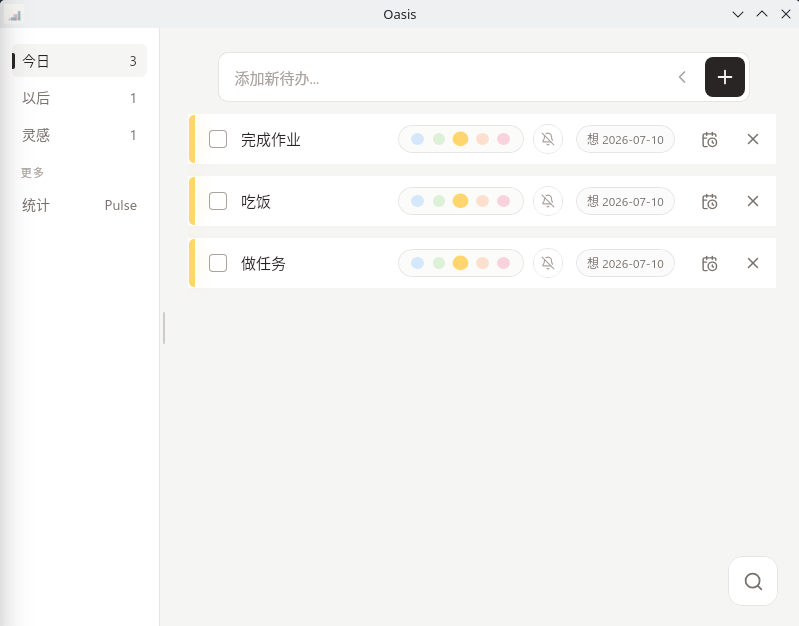
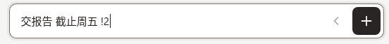
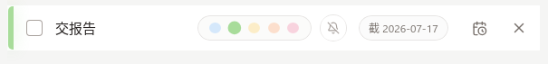
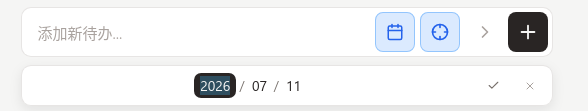
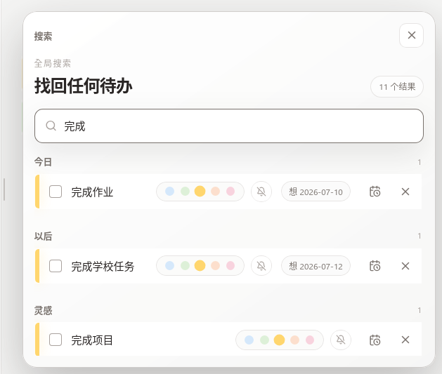

# Oasis Flow 使用教程

这份教程写给第一次使用 Oasis Flow 的你。无需提前配置项目、清单或工作流，打开应用后，从记下一件现在关心的事开始就好。



## 1. 先认识三个列表

Oasis 会根据任务的日期，自动把它们放到合适的位置：

| 列表 | 适合放什么 |
| --- | --- |
| **今日** | 今天想做、今天截止，以及已经过期但还没完成的事 |
| **以后** | 安排在未来或将来才截止的事 |
| **灵感** | 暂时没有日期的想法和任务 |

应用启动后默认打开“今日”。桌面端可从左侧切换列表，移动端可点击顶部的列表名称切换。

## 2. 添加第一条待办

在底部或页面上方的输入框中输入任务，例如：

```text
买牛奶
```

按 `Enter`，或点击右侧的 **+** 按钮，即可添加。没有日期的任务会进入“灵感”。

### 用一句话安排日期和优先级

Oasis 能从输入内容中识别常见的日期和优先级：

| 输入示例 | Oasis 会怎样处理 |
| --- | --- |
| `买牛奶 明天` | 正文为“买牛奶”，安排到明天 |
| `交报告 截止周五 !2` | 周五截止，优先级为 2 |
| `下周三 复诊 p5` | 安排到下周三，优先级为 5 |
| `7月10日 还书` | 安排到 7 月 10 日 |

支持 `今天`、`明天`、`后天`、`周五`、`下周三`、`7月10日` 和 `2026-07-10` 等写法。优先级可以写成 `!1`—`!5` 或 `p1`—`p5`。

下面的例子输入了 `交报告 截止周五 !2`：



添加后，日期和优先级标记会从正文中移除，并显示为待办的独立状态：



> 没有“截止”“到期”等提示词时，日期默认表示你**想在哪天做**；例如 `明天买牛奶` 并不代表它明天必须完成。

### 手动选择日期

如果不想使用文字解析：

1. 点击输入框右侧的展开按钮。
2. 点击日历按钮选择日期。
3. 默认设置的是“想做日期”；勾选靶心形状的“必做”按钮后，所选日期会变成截止日期。
4. 点击 **+** 完成添加。



## 3. 想做日期和截止日期有什么区别

- **想做日期**：你计划处理这件事的日期，可以理解为“我想在这天做”。
- **截止日期**：真正的最后期限，可以理解为“最晚必须在这天完成”。

同一条待办当前只保留其中一种日期。输入中同时出现两种日期时，截止日期优先。

## 4. 完成、修改和删除待办

### 桌面端

- 点击待办前的复选框，将它标记为完成或恢复为未完成。
- 点击任务文字，可直接编辑内容；按 `Enter` 或移开焦点保存。
- 点击日期按钮可修改或清除日期。
- 点击彩色圆点可设置 1—5 级优先级。
- 点击铃铛可开启或关闭提醒。
- 点击待办右侧的删除按钮可删除任务。

### 移动端

- 点一下待办内容，将它标记为完成或恢复为未完成。
- 长按待办内容，可修改文字。
- 向左滑动足够距离，可删除待办。
- 点一下日期标签，可开启或关闭提醒。
- 长按日期标签，可修改日期。
- 也可以直接点击复选框完成任务。

## 5. 使用提醒

提醒适合有明确日期、且你不想错过的待办。

1. 先给待办设置想做日期或截止日期。
2. 点击铃铛；移动端则点一下日期标签。
3. 第一次使用移动端时，请允许 Oasis 发送系统通知。

Oasis 会对符合条件的今日或逾期待办进行温和提醒。系统通知被关闭时，请前往设备设置重新授权。

## 6. 找回一条待办

点击放大镜打开全局搜索。搜索范围包括“今日”“以后”“灵感”和已经完成的任务。

你可以搜索：

- 任务内容，例如 `报告`；
- 日期，例如 `2026-07-10`；
- 优先级，例如 `p1` 或 `!3`。

搜索结果中也可以直接完成、编辑、改日期、改优先级、开关提醒或删除待办。



## 7. 查看完成情况

桌面端点击左侧的“统计”，移动端点击顶部的统计图标。统计页会显示：

- 本周完成数量；
- 连续完成天数；
- 最近 7 天的完成趋势；
- 最近完成的待办。

这些数据用于帮你看到自己的节奏，不要求每天保持同样的完成量。

[观看统计页面的短演示](images/user-guide/stats-demo.webm)

## 8. 一个简单的使用方法

如果你还不知道怎样组织待办，可以先这样使用：

1. 想到一件事就先记下来，不确定日期时让它留在“灵感”。
2. 每天从“今日”开始，只处理今天真正关心的任务。
3. 确定将来要做的事，给它加一个想做日期。
4. 只有真正不能错过的期限，才使用截止日期和提醒。
5. 忘记任务放在哪里时，直接搜索，不必逐个列表翻找。

## 9. 数据保存在哪里

Oasis 会自动把数据保存在设备本地的 `todos.json` 文件中，不使用浏览器 localStorage。关闭应用后，待办不会丢失。

在导入、导出和自动备份功能完成前，如果要迁移设备或重装系统，建议先手动备份该文件：

- Windows：`%APPDATA%\com.uno.oasis\todos.json`
- macOS：`~/Library/Application Support/com.uno.oasis/todos.json`
- Linux：`~/.local/share/com.uno.oasis/todos.json`

Android 的应用数据由系统管理。卸载应用前，请确认自己不再需要其中的数据。

## 10. 常见问题

### 为什么新任务跑到了“灵感”？

因为它没有日期。给它加上今天或未来日期后，它会自动进入“今日”或“以后”。

### 为什么输入里的日期和 `!2` 消失了？

这是正常行为。Oasis 会把它们解析为日期和优先级，任务列表里只显示清理后的正文及对应状态。

### 优先级 1 和 5，哪个更高？

数字越大优先级越高，5 为最高，1 为最低；未指定时默认为 3。

### 为什么提醒没有出现？

请依次确认待办已有日期、提醒已经开启、任务尚未完成，并且系统允许 Oasis 发送通知。

### 可以在多台设备间同步吗？

当前版本的数据保存在每台设备本地，尚未提供内置同步。导入、导出、备份和同步能力已列入后续路线图。

---

Oasis Flow 采用 GPL-3.0-or-later 许可证。  
Copyright (C) 2026 Uno.
